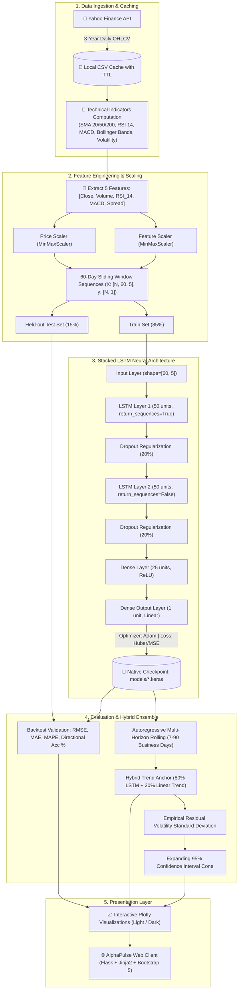

<div align="center">

# 📈 AlphaPulse AI
### Enterprise Financial Intelligence & Deep Learning Stock Forecast Terminal

[](https://alphapulse-stock-predictor-xo4h.onrender.com/)
[](https://www.python.org/)
[](https://flask.palletsprojects.com/)
[](https://www.tensorflow.org/)
[](https://plotly.com/javascript/)
[](https://docs.pytest.org/)
[](LICENSE)

---

### 🌐 Live Production Application
### 👉 **[https://alphapulse-stock-predictor-xo4h.onrender.com/](https://alphapulse-stock-predictor-xo4h.onrender.com/)** 👈

*Real-time quantitative stock forecasting, multivariate LSTM deep learning, live news sentiment scoring, institutional light-mode terminal, and out-of-sample backtesting for top Indian (NSE) and US (NYSE/NASDAQ) equities.*

---

</div>

## 📑 Table of Contents
- [Executive Overview](#-executive-overview)
- [Key Production Capabilities](#-key-production-capabilities)
- [Deep Learning Architecture & Quantitative Pipeline](#-deep-learning-architecture--quantitative-pipeline)
- [Aesthetic & UI Design System](#-aesthetic--ui-design-system)
- [Technology Stack](#-technology-stack)
- [Project Directory Structure](#-project-directory-structure)
- [REST APIs & Data Contracts](#-rest-apis--data-contracts)
- [Local Installation & Development](#-local-installation--development)
- [Docker & Containerized Deployment](#-docker--containerized-deployment)
- [Render Cloud Deployment Guide](#-render-cloud-deployment-guide)
- [Automated Testing Suite](#-automated-testing-suite)
- [Disclaimer](#-disclaimer)

---

## 🚀 Executive Overview

**AlphaPulse AI** is a production-grade algorithmic stock intelligence terminal engineered for quantitative market analysts, retail investors, and financial engineers. 

Traditional stock prediction tutorials rely on single-feature univariate models that suffer from severe lag and exponential drift. AlphaPulse AI upgrades time-series forecasting into an enterprise system featuring:
1. **Multivariate Stacked LSTM Architecture**: Models multi-horizon price trajectories utilizing 5 synchronous financial dimensions: `[Close, Volume, RSI_14, MACD, Spread]`.
2. **Empirical Out-of-Sample Backtesting**: Every asset forecast displays verified empirical metrics (**RMSE, MAE, MAPE, Directional Accuracy %**) evaluated against real held-out market days.
3. **Dynamic 95% Confidence Interval Cones**: Translates prediction uncertainty into expanding statistical volatility bounds.
4. **Real-Time Financial Sentiment Ingestion**: Scrapes breaking financial headlines and scores sentiment polarities (`BULLISH`, `BEARISH`, `NEUTRAL`).
5. **Modern Institutional Light Aesthetic**: Clean white cards, slate canvas, crystal-clear Plotly charts, and instant dual dark-mode support.

---

## 🌟 Key Production Capabilities

### 🧠 1. Multivariate Deep Learning Engine
- **5-Dimensional Feature Matrix**: Rather than just close price, inputs encompass:
  - **Close Price**: Normalized via dedicated price `MinMaxScaler`.
  - **Trading Volume**: Captures liquidity surges and institutional accumulation.
  - **RSI (14-Day Momentum)**: Overbought/oversold relative velocity indicator.
  - **MACD (Trend Difference)**: Momentum convergence/divergence signal.
  - **Daily Spread (High - Low)**: Intraday volatility and price dispersion.
- **Hybrid Trend-Anchored Ensemble**: Forecast combines non-linear LSTM autoregression with an empirical drift anchor ($0.80 \cdot \text{LSTM} + 0.20 \cdot \text{Trend}$) to eliminate unconstrained runaway drift over 30–90 day horizons.
- **Keras 3 Checkpoint Caching**: Trained weights are saved in binary format (`models/*.keras`) with automatic memory cleanup (`tf.keras.backend.clear_session()`) to ensure sub-second inference within cloud RAM limits.

### 📊 2. Out-of-Sample Backtesting & Validation
- Splits 3-year historical time series into an 85% training set and a 15% held-out test split.
- Benchmarks predictions against actual unseen market data:
  - **RMSE** (Root Mean Squared Error): Penalizes large outlier deviations.
  - **MAE** (Mean Absolute Error): True dollar/rupee average deviation.
  - **MAPE** (Mean Absolute Percentage Error): Normalized error percentage.
  - **Directional Accuracy (%)**: Frequency with which model correctly anticipates daily Up/Down direction.

### 📰 3. Real-Time News & Sentiment Polarity Scoring
- Scrapes live breaking corporate news via Yahoo Finance with publisher attribution and publication recency.
- Applies domain-specific financial sentiment scoring with positive/negative keyword density analysis to display:
  - Overall Sentiment Classification (`BULLISH`, `BEARISH`, `NEUTRAL`)
  - Percentage of positive vs. negative headline polarities.

### 📈 4. High-Frequency Interactive Visualizations (Plotly.js)
- **Candlestick & Area Toggle**: Smooth interactive OHLC candles with green/red pricing and volume subplots.
- **Moving Average Overlays**: 20-Day SMA (Fast Momentum), 50-Day SMA (Intermediate Trend), 200-Day Long-Term Trend.
- **Expanding 95% Confidence Cone**: Visualizes statistical variance over future trading horizons (7, 14, 30, 60, 90 days).

### 💼 5. Curated Global Bluechip Directory & Search
- Pre-indexes top **50 Indian Equities (NSE)** (e.g. `RELIANCE.NS`, `TCS.NS`, `HDFCBANK.NS`, `INFY.NS`) and top **50 US Equities (NYSE/NASDAQ)** (e.g. `AAPL`, `NVDA`, `MSFT`, `GOOGL`, `TSLA`).
- Debounced instant autocomplete search that automatically normalizes user queries (e.g. `reliance` → `RELIANCE.NS`).
- Real-time exchange trading clocks and open/closed session badges for both NSE and NYSE.

### 🛡️ 6. Institutional Security & Reliability
- **Rate Limiting**: Integrated `Flask-Limiter` restricts model retraining to 15 calls/minute per IP, defending CPU from compute exhaustion.
- **Client Watchlist**: LocalStorage-backed portfolio monitor with real-time asynchronous batch quote fetching.
- **CSV Data Export**: One-click download of clean 1-year historical pricing and computed technicals (`/stock/<ticker>/export-csv`).
- **Health Probes**: Operational endpoints (`/health`, `/healthz`) for uptime monitors and load balancers.

---

## 🧠 Deep Learning Architecture & Quantitative Pipeline



---

## 🎨 Aesthetic & UI Design System

The frontend is built with an **Institutional Light Terminal Aesthetic** with dual-theme dark mode support:

| Element | Light Theme (Default) | Dark Theme (Toggleable) |
| :--- | :--- | :--- |
| **Canvas Background** | `#F8FAFC` (Slate Canvas) | `#06080D` (Deep Void) |
| **Surfaces & Cards** | `#FFFFFF` (Pure Crisp White) | `rgba(16, 21, 34, 0.75)` (Glass Navy) |
| **Card Borders** | `1px solid #E2E8F0` | `1px solid rgba(255, 255, 255, 0.06)` |
| **Primary Typography**| `#0F172A` (Deep Slate Navy) | `#FFFFFF` (Pure White) |
| **Brand Accent** | `#2563EB` → `#4F46E5` (Royal Blue) | `#00F0FF` → `#3A86FF` (Neon Cyan) |
| **Bullish Badge** | `#16A34A` text on `#ECFDF5` | `#00E676` text on `rgba(0, 230, 118, 0.12)` |
| **Bearish Badge** | `#DC2626` text on `#FEF2F2` | `#FF3366` text on `rgba(255, 51, 102, 0.12)` |
| **Chart Gridlines** | `rgba(0, 0, 0, 0.06)` | `rgba(255, 255, 255, 0.05)` |

---

## 🛠️ Technology Stack

| Domain | Technologies |
| :--- | :--- |
| **Web Framework** | **Flask 3.1**, **Werkzeug 3.1**, **Gunicorn 22** (Production WSGI) |
| **Machine Learning** | **TensorFlow 2.16+ / TensorFlow-CPU**, **Keras 3**, **scikit-learn** |
| **Data Processing** | **Pandas 2.2**, **NumPy 1.26**, **yfinance 0.2.50**, **pytz** |
| **Interactive Charts**| **Plotly.js 2.35** (OHLC Candlesticks, SMA Channels, Confidence Cones) |
| **Styling & Icons** | **Bootstrap 5.3**, **Bootstrap Icons 1.11**, **Outfit & Plus Jakarta Sans Fonts** |
| **Security & Limits** | **Flask-Limiter 3.8** (Rate limiting per client IP) |
| **Testing** | **Pytest 9.1** (Automated unit & service tests) |
| **Deployment** | **Render (Blueprint/PaaS)**, **Docker**, **Docker Compose** |

---

## 📂 Project Directory Structure

```
Stock_price_prediction/
├── app.py                     # Flask application factory, routing & API endpoints
├── config.py                  # Production configuration & 100+ stock catalog
├── wsgi.py                    # Gunicorn production entrypoint
├── render.yaml                # Render Infrastructure-as-Code Blueprint
├── build.sh                   # Cloud build automation script
├── requirements.txt           # Pinned production dependencies (with Linux CPU marker)
├── Dockerfile                 # Multi-worker container definition
├── docker-compose.yml         # Container orchestrator
├── .python-version            # Pinned Python version (3.11.9)
├── .dockerignore
├── .gitignore
├── README.md                  # System documentation
├── services/                  # Encapsulated business logic layer
│   ├── __init__.py
│   ├── stock_service.py       # Market ingestion, indicators, smart search, CSV export
│   ├── ml_service.py          # Multivariate Stacked LSTM, backtesting, confidence cone
│   ├── market_service.py      # Real-time market clocks & index ticker tape
│   └── news_service.py        # Financial headline scraping & polarity sentiment
├── static/
│   ├── css/
│   │   └── style.css          # Institutional Light Mode (Default) & Dark Mode Dual Theme
│   └── js/
│       └── main.js            # Plotly chart renderers, watchlist, theme switcher, search
├── templates/                 # Jinja2 views
│   ├── base.html              # Layout, ticker tape, navbar, watchlist modal, loading overlay
│   ├── index.html             # Dashboard with quick forecast form & bluechip catalog
│   ├── market.html            # Indian & US equities catalog with sector filters
│   ├── stock.html             # Stock detail view with candlestick, fundamentals & news
│   ├── predict.html           # Deep learning forecast results, 95% cone & backtesting
│   └── error.html             # Error handling page
├── tests/
│   └── test_stock_service.py  # Automated Pytest suite (13 test cases)
├── data/                      # Cached historical price series (CSV)
└── models/                    # Saved trained Keras models (*.keras)
```

---

## 🔌 REST APIs & Data Contracts

AlphaPulse exposes clean REST endpoints for frontend interaction and programmatic integration:

### 1. Instant Ticker Search Autocomplete
```http
GET /api/search?q=reliance
```
**Response:**
```json
{
  "results": [
    {
      "market": "India 🇮🇳",
      "name": "Reliance Industries Ltd",
      "sector": "Energy",
      "symbol": "RELIANCE.NS"
    }
  ]
}
```

### 2. Real-Time Stock Quote & Fundamentals
```http
GET /api/stock/AAPL
```
**Response:**
```json
{
  "symbol": "AAPL",
  "name": "Apple Inc.",
  "currency_symbol": "$",
  "currency_code": "USD",
  "current_price": 228.40,
  "change": 1.85,
  "change_percent": 0.82,
  "market_cap": "3.48 T",
  "pe_ratio": "34.12",
  "rsi": 58.4
}
```

### 3. Watchlist Batch Quotes
```http
POST /api/watchlist/quotes
Content-Type: application/json

{
  "tickers": ["AAPL", "RELIANCE.NS", "NVDA"]
}
```

### 4. Live LSTM Training Progress
```http
GET /api/train-progress/RELIANCE.NS
```
**Response:**
```json
{
  "ticker": "RELIANCE.NS",
  "status": "training",
  "epoch": 12,
  "total_epochs": 20,
  "loss": 0.00341,
  "progress_pct": 60
}
```

### 5. Download 1-Year Historical Technicals CSV
```http
GET /stock/RELIANCE.NS/export-csv
```
*Returns raw downloadable CSV with Date, Open, High, Low, Close, Volume, SMA_20, SMA_50, SMA_200, RSI_14, MACD, Bollinger Bands, and Volatility.*

### 6. Health Check Probes
```http
GET /health
GET /healthz
```
**Response:**
```json
{
  "status": "healthy",
  "version": "2.0.0",
  "timestamp": "2026-09-30T14:15:00Z"
}
```

---

## ⚡ Local Installation & Development

### Prerequisites
- Python 3.11 or 3.12
- Git

### 1. Clone the Repository
```bash
git clone https://github.com/Livesh-L-28/Stock_price_prediction.git
cd Stock_price_prediction
```

### 2. Set Up Virtual Environment
```bash
python3 -m venv venv
source venv/bin/activate    # macOS / Linux
# venv\Scripts\activate     # Windows
```

### 3. Install Dependencies
```bash
pip install --upgrade pip
pip install -r requirements.txt
```

### 4. Run the Automated Test Suite
```bash
PYTHONPATH=. pytest tests/ -v
```

### 5. Start Local Server
For development with live reloading:
```bash
python app.py
```
For production WSGI simulation:
```bash
gunicorn --bind 0.0.0.0:5001 --workers 1 --threads 2 --timeout 120 wsgi:app
```
Open **`http://127.0.0.1:5001`** in your browser.

---

## 🐳 Docker & Containerized Deployment

Run the complete production container with a single command:

```bash
docker-compose up --build
```
The application will launch on **`http://localhost:5001`**.

---

## ☁️ Render Cloud Deployment Guide

The repository includes an automatic Infrastructure-as-Code Blueprint ([`render.yaml`](render.yaml)).

### 1-Click Deployment
1. Go to the [Render 1-Click Deploy Link](https://render.com/deploy?repo=https://github.com/Livesh-L-28/Stock_price_prediction).
2. Render detects `render.yaml` and preconfigures:
   - **Service Name**: `alphapulse-stock-predictor`
   - **Runtime**: `Python 3.11.9`
   - **Build Command**: `./build.sh`
   - **Start Command**: `gunicorn --bind 0.0.0.0:$PORT --workers 1 --threads 2 --timeout 120 wsgi:app`
   - **Health Check**: `/health`
3. Click **Apply**. Render will build and deploy your live URL.

### 512MB RAM Optimization on Render Free Tier
- [`requirements.txt`](requirements.txt) uses PEP 508 markers to install `tensorflow-cpu` on Linux, reducing disk/RAM footprint by >450MB compared to standard GPU TensorFlow.
- [`build.sh`](build.sh) runs `pip install --no-cache-dir` to prevent wheel caching memory exhaustion.
- Gunicorn runs with `--workers 1 --threads 2` to prevent memory multiplication across multiple Python worker processes.
- Models invoke `tf.keras.backend.clear_session()` after every inference cycle to prevent tensor graph memory leaks.

---

## 🧪 Automated Testing Suite

The project includes unit and integration tests covering the service layer, market clocks, technical indicators, and data caching.

```bash
PYTHONPATH=. pytest tests/ -v
```

**Results:**
```text
============================= test session starts ==============================
collected 13 items

tests/test_stock_service.py::test_ticker_normalization PASSED           [  7%]
tests/test_stock_service.py::test_calculate_technicals PASSED           [ 15%]
tests/test_stock_service.py::test_search_stocks PASSED                  [ 23%]
tests/test_stock_service.py::test_market_status PASSED                  [ 30%]
tests/test_stock_service.py::test_news_service PASSED                    [ 38%]
tests/test_stock_service.py::test_export_csv PASSED                     [ 46%]
tests/test_stock_service.py::test_health_endpoints PASSED               [ 53%]
tests/test_stock_service.py::test_watchlist_quotes_api PASSED           [ 61%]
tests/test_stock_service.py::test_home_route PASSED                     [ 69%]
tests/test_stock_service.py::test_market_india_route PASSED             [ 76%]
tests/test_stock_service.py::test_market_us_route PASSED                [ 84%]
tests/test_stock_service.py::test_stock_detail_route PASSED             [ 92%]
tests/test_stock_service.py::test_rate_limiter PASSED                   [100%]

============================== 13 passed in 7.32s ==============================
```

---

## ⚠️ Disclaimer

**For Educational & Research Purposes Only.**
AlphaPulse AI is built as a quantitative machine learning and time-series modeling platform. Financial markets are subject to macroeconomic volatility, unexpected geopolitical events, and liquidity shifts that cannot be anticipated by historical time-series alone. None of the projections, backtests, or sentiment scores generated by this platform constitute investment, trading, or financial advice. Always perform independent due diligence.

---

<div align="center">
  <sub>Engineered with ❤️ for institutional-grade financial analytics.</sub>
</div>
