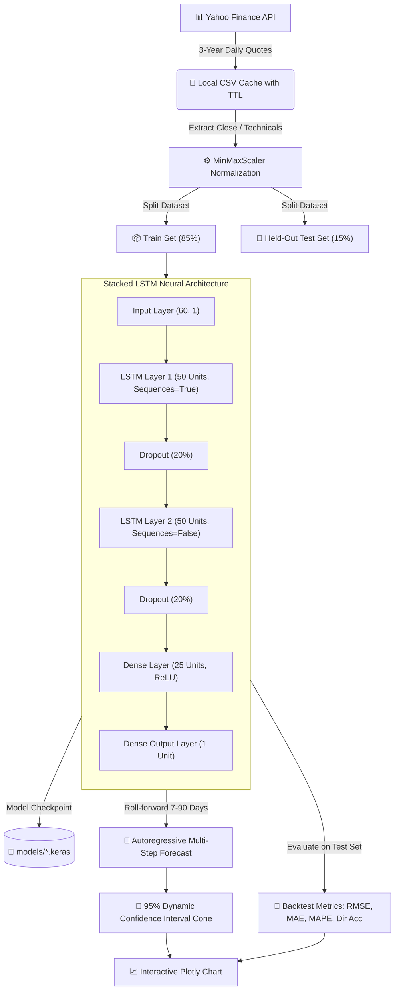

<div align="center">

# 📈 AlphaPulse AI — Production Stock Intelligence & Deep Learning Predictor

<p align="center">
  
  
  
  
  
  
  
  
</p>

### 🚀 Production-Grade Real-Time Indian 🇮🇳 (NSE) & US 🇺🇸 (NYSE/NASDAQ) Stock Trend Prediction, Technical Momentum Analytics, and Out-of-Sample LSTM Backtesting

---

</div>

## 🌟 Key Production Features

- **🧠 Stacked LSTM Neural Architecture**: 60-day historical sequence memory with dropout regularization, input layer standardization, and dense forecast projections.
- **⚡ Persistent Model Checkpointing**: Pretrained models are saved as native binary artifacts (`models/*.keras`). Cached models serve sub-second inferences without re-training overhead.
- **📊 Real Out-of-Sample Backtesting**: Displays concrete generalization metrics:
  - **RMSE** (Root Mean Squared Error)
  - **MAE** (Mean Absolute Error)
  - **MAPE** (Mean Absolute Percentage Error)
  - **Directional Accuracy %** (Daily Up/Down prediction accuracy)
- **📈 Interactive Plotly Financial Charts**:
  - Full OHLC Candlestick charts with 20-day & 50-day Simple Moving Average (SMA) overlays.
  - Subplot volume analytics with bullish/bearish color coding.
  - Auto-regressive forecast line accompanied by a **95% dynamic confidence interval cone**.
- **🎯 Comprehensive Technical Indicators**:
  - Relative Strength Index (**RSI 14**) with Overbought (≥70) and Oversold (≤30) alerts.
  - Moving Average Convergence Divergence (**MACD**, Signal Line, Histogram).
  - **Bollinger Bands** (20-day mean ± 2 standard deviations).
  - 30-Day Annualized Historical Volatility.
- **🇮🇳 & 🇺🇸 Curated Global Blue-Chips**: 50 Top Indian Blue-chips (`RELIANCE.NS`, `TCS.NS`, `HDFCBANK.NS`, `INFY.NS`, etc.) and 50 US Tech/Industrial Leaders (`AAPL`, `NVDA`, `MSFT`, `GOOGL`, `TSLA`, etc.).
- **🔍 Instant Autocomplete Search API**: Real-time ticker search and smart ticker auto-normalization (e.g. typing `reliance` auto-maps to `RELIANCE.NS` with Indian Rupee `₹` formatting).
- **🌐 Real-Time Market Session Tracker**: Live ribbon tracking trading hours and open/closed status for NSE (India) and NYSE/NASDAQ (US).
- **🐳 Enterprise Containerization**: Dockerfile with multi-worker Gunicorn WSGI configuration and Docker Compose setup.

---

## 🛠️ Technology Stack

| Domain | Technologies |
| :--- | :--- |
| **Backend Framework** |  Flask 3.1 & Gunicorn 26 WSGI Server |
| **Machine Learning** |   Stacked LSTM (Input(60, 1) + 2x LSTM(50) + Dropout(0.2) + Dense) |
| **Data Processing** |    `MinMaxScaler`, Regression Metrics |
| **Data Provider** |  `yfinance` 3-Year Historical API with CSV Cache & TTL |
| **Interactive Visuals** |  Plotly.js High-Frequency Interactive Candlestick & Forecast Graphs |
| **Frontend UI** |  Dark-mode Bloomberg / TradingView terminal aesthetic |
| **Testing & CI** |  Automated integration & unit test suite |

---

## 🧠 Model Architecture & Forecasting Pipeline



---

## 📂 Production Directory Structure

```
Stock_price_prediction/
├── app.py                     # Flask application factory, routing & API endpoints
├── config.py                  # Production configuration & 100+ stock catalog
├── wsgi.py                    # Gunicorn production entry point
├── requirements.txt           # Pinned production dependencies
├── Dockerfile                 # Multi-worker container definition
├── docker-compose.yml         # Container orchestrator
├── .dockerignore
├── .gitignore
├── README.md                  # System documentation
├── services/                  # Business logic & services layer
│   ├── __init__.py
│   ├── stock_service.py       # Data fetching, caching, technical indicators & search
│   ├── ml_service.py          # LSTM training, model checkpointing & forecasting
│   └── market_service.py      # Market session tracker & benchmark indices
├── static/
│   ├── css/
│   │   └── style.css          # Dark financial Bloomberg terminal design system
│   └── js/
│       └── main.js            # Autocomplete, loading states & Plotly chart engines
├── templates/                 # Jinja2 views
│   ├── base.html              # Core layout with market ribbon & navbar
│   ├── index.html             # Market dashboard & quick forecast widget
│   ├── market.html            # Indian & US stock catalog explorer
│   ├── stock.html             # Stock detail view with candlestick & technicals
│   ├── predict.html           # Deep learning forecast results with confidence cone
│   └── error.html             # Error handling page
├── tests/
│   └── test_stock_service.py  # Automated Pytest test suite
├── data/                      # Cached historical price series (CSV)
└── models/                    # Saved trained Keras models (*.keras)
```

---

## ⚡ Quick Start & Installation

### Option A: Local Python Environment

#### 1. Clone & Navigate
```bash
git clone https://github.com/Livesh28/Stock_price_prediction.git
cd Stock_price_prediction
```

#### 2. Create Virtual Environment
```bash
python3 -m venv venv
source venv/bin/activate  # macOS / Linux
# venv\Scripts\activate   # Windows
```

#### 3. Install Dependencies
```bash
pip install -r requirements.txt
```

#### 4. Run Test Suite
```bash
PYTHONPATH=. pytest tests/ -v
```

#### 5. Launch Application
For development:
```bash
python app.py
```
For production WSGI:
```bash
gunicorn --bind 0.0.0.0:5001 --workers 2 --threads 2 --timeout 120 wsgi:app
```

Open your browser at: **`http://127.0.0.1:5001`**

---

### Option B: Docker Container Deployment

Run the complete production application with a single command:
```bash
docker-compose up --build
```
The application will be accessible at **`http://localhost:5001`**.

---

## 🔌 REST APIs

The application exposes REST endpoints for programmatic integrations:

### 1. Instant Ticker Search
```http
GET /api/search?q=apple
```
**Response:**
```json
{
  "results": [
    {
      "market": "US 🇺🇸",
      "name": "Apple Inc.",
      "sector": "Consumer Electronics",
      "symbol": "AAPL"
    }
  ]
}
```

### 2. Real-Time Stock Quote & Fundamentals
```http
GET /api/stock/RELIANCE.NS
```
**Response:**
```json
{
  "symbol": "RELIANCE.NS",
  "name": "Reliance Industries Ltd",
  "currency_symbol": "₹",
  "currency_code": "INR",
  "current_price": 2980.50,
  "market_cap": "20.15 T",
  "pe_ratio": "27.40",
  "rsi": 56.4
}
```

---

## 📜 License

This project is open-source and distributed under the **MIT License**.
